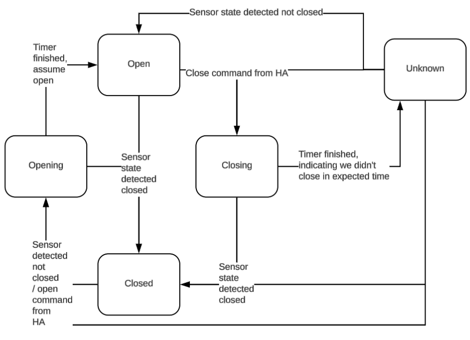
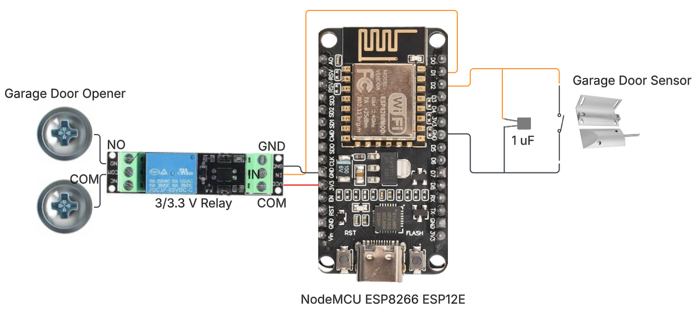

## Introduction

This journey started from a desire to set up and host my own smart-home setup, more specifically, a custom smart garage door opener. The overzealous dream was to write *everything* from creating the infrastructure, the host server, smart devices connected to system, and desiging the interface. This blog documents my journey of realizing that there are easier ways, learning about open source options along the way, and what the *dream* turned into!

## Initial "Smart Home" Research

To start out this journey, I knew that I needed to first set up *some* type of smart home system. This was a pre-requisite to creating my own custom smart garage door opener, which was where this project started!

Early on, I realized that there were lots of popular open source home automation systems already on the market that I could utilize: [Home Assistant](https://www.home-assistant.io/), [openHAB](https://www.openhab.org/), and more. After a quick comparison, I **decided on Home Assistant**. This decision was largely based on the high-lvel of open source support for it, and the option to host it on a Raspberry Pi, which was a device I'd been wanting to tinker with as well. 

## Setting up Home Assistant

To begin setting up Home Assistant, I purchased a [Respberry Pi kit](https://www.amazon.com/dp/B0D95QBKJ4?ref_=ppx_hzsearch_conn_dt_b_fed_asin_title_2&th=1) that I could flash Home Assistant on. Thankfully, Home Assistant had a [great tutorial](https://www.home-assistant.io/installation/raspberrypi) for how to set up Home Assistant on a Pi, and I didn't have any issues with the initial set-up.

After Home Assistant booted up, I was able to create an account and voila! I had a smart home set up that I could connect devices to.

## Developing a custom smart garage door opener. 

Now that I had the smart home network set up, it was time to start developing my custom smart garage door opener!

### Defining the requirements

To start, my self-defined reqiurements were to use a small microcontroller so that it would be low-profile when mounted. At a base level, the opener needed to be able to *at least* sense if the garage door is closed or not, as well as simulate a button press to open or close the garage door.

#### Wait, How do you simulate pressing the garage door button?

Every day, before I leave the house, I walk into the garge, press the button on the wall to open the garage door, and then get into my car to leave. BUT, how did that actually work? How did pressing the garage door button **ACTUALLY** make the garage door open? 

In short, when you look at how your garage door is set up, you will see some small wires tracking from the garage door button to 2 screws on the garage door. When the button is presses, it closes the circuit and sends a signal to the garage door telling it to start the motor, which will run for a set amount of time, pulling the garage door belt, and therefore opening the door. 

The key component to simulate here is the closing of the circuit to signal to the motor to start. Thankfully, on my garage door opener, access to the screws mentioned above is easy and therefore we can easily test this theory! 

> NOTE: For those following along, proceed with some caution on the following steps. 

To test this, I simply took a long jumper wire (insulated, of course) and connected it to both screws at the same time. **Just** like that! The garage door began to open! 

### Selecting hardware

Now that we know the requirements and have answers to some key questions, we can make our hardware selections.

#### Micro-controller

There were two options that I considered for the micro-controller, the [esp8266 esp-01](https://www.amazon.com/dp/B010N1ROQS?ref_=ppx_hzsearch_conn_dt_b_fed_asin_title_7) and the [esp8266 NodeMCU ESP-12F](https://www.amazon.com/dp/B09QXHWLTJ?ref_=ppx_hzsearch_conn_dt_b_fed_asin_title_2).

At first, I went for the *esp-01* and made some initial progress with it. However, to flash this device, it required jumpers to certain pins, or a separate flasher micro-controller. This made it more difficult to develop and a slower inner loop. I knew that over the long term, as I tested and iterated, this would be frustrating. Comparatively, the NodeMCU can be flashed directly via USB. While the board is slightly larger, it will make development life much easier. Therefore, I bumped up to the NodeMCU.

#### Sensor

To sense whether the garage door was open or not, I needed some sort of sensor that could mount to the frame of the garage and the garage door to indicate if it was closed. To do this, I found that a [magnetic reed switch](https://www.amazon.com/dp/B0BCYHBKVF?ref_=ppx_hzsearch_conn_dt_b_fed_asin_title_4) would do the trick.


Sneak peak of the final set-up of the reed switch!

#### Simulate button press

As discussed above, to simulate a button press, we need to close the circuit between two specific screws on the garage door for a short amount of time to open/close the garage door. To do this, we can use a [relay](https://www.amazon.com/dp/B07XGZSYJV?ref_=ppx_hzsearch_conn_dt_b_fed_asin_title_1)! By sending a digital signal to the relay, it will close the circuit of the input wires. We can wire the garage door screws to the relay and control it via our software!

Here is an image of the terminals that needed to be connected in order to simulate a button press. These terminals were mentioned as well in [this section about how to simulate a button press](#wait-how-do-you-simulate-pressing-the-garage-door-button). Also, the yellow wires are a sneak peak! They are connected to the relay, keep reading!


The two screws on the left are the screws controlling the operation.

> One important thing to remember is what voltage input is needed for the switch. One mistake I made here was accidentally buying switches that needed 5V, while the NodeMCU didn't have a 5V pin output! I had to eventually realize this and switch to the smaller 3v3 relays that would still work for the garage.

#### 1 uF capacitor

> Sneak peak! Keep reading for when this comes into play.

### Designing the system

Now that we've selected the hardware and have a rough plan for how to utilize them, we can design the system!

#### Software design

The core components that need to be designed are the following:

1. Communication from the opener to the HA system.
2. Reading sensor values to assess the state of the garage door. 
3. Triggering simulated button presses
4. A state machine for the state of the garage door. 

#2 and #3 are relatively simple, as they simply require reading in/writing out digital values from/to digital pins on the micro-controller. Specifically for #3, simulating a button press would involve turning on the relay and quickly (50 ms later) turning off the relay. 

##### MQTT

For #1, communication from the opener to the HA system, there is theoretically many possibilities. However, I was already familiar with MQTT, which stands for Messaeg Queuing Telemetry Transport. Additionally, because the ESP already has built-in WiFi capabilities, this was a simple protocol to onboard to, and it's commonly used across the industry to communicate between devices. An added plus is that you can set up MQTT brokers and subscribers to require username and password authentication!

##### System State Machine

Designing the state machine took a little bit of time to diagnose and confirm some of the edge cases, but the overall states are the following: 

- Open
- Closed
- Opening
- Closing
- Unknown

Some of them are self-explanatory, but some are not. For example, when would the "Unknown" state occur? For my garage door, the door takes around 12 seconds to close. Therefore, I created a 15 second timer that would essentially force a change into the Unknown State if the door isn't in the expected state in time. However, in my system, this exposes one assumption that is important to consider. I only am using one sensor in this system that reports when the door is **closed**. However, there is not a sensor to explicitly detect when the door is fully open. Therefore, when the state transitions from Closed->Opening->Open, this is primarily based on waiting for the 15 seconds and if we haven't detected any other issues, we assume it's fully open. 

Below is a diagram of the entire state machine.



#### Circuit design

Overall (at first glance), this circuit design was *very* simple. I would only need the following:

- A reed switch. 1 wire connected to GND and 1 connected to a digital input pin on the ESP.
- A relay, connected to the garage door opener. The flow would be the following:
  - 1 wire from GND to relay GND
  - 3v3 to power input of relay
  - Digital output control to relay control. 
  - The 2 screw terminals of interest from the garage door opener to the relay inputs. 

These are the only external components that we would need to monitor the state of the garage door, and to control opening/closing the garage. Right?? (*Foreshadowing to an issue I hit and solved, keep reading*)

### Let's get building!

Now, I was ready to write the code and set up the circuit! As a way to quickly get set up and iteratoe on this project, I started out using Arduino. Arduino already has libraries for MQTT, WiFi, and for general digital pin controls. Also, there was [easy documentation for how to build and flash for the ESP device available online](https://projecthub.arduino.cc/PatelDarshil/getting-started-with-nodemcu-esp8266-on-arduino-ide-b193c3). The libraries I used are the following

- MQTT: [PubSubClient](https://docs.arduino.cc/libraries/pubsubclient/)
- WiFi: [ESP8266WiFi.h](https://arduino-esp8266.readthedocs.io/en/latest/esp8266wifi/readme.html)

Thanks to the design work listed above, this work was relatively straight forward. I went piece by piece, implementing first the connections to WiFi and MQTT, then implementing and testing the reading of the reed switch, the controlling of the relay, and then the state machine!

> One extremely useful tool to help test quickly with MQTT was the [MQTTool](https://apps.apple.com/us/app/mqttool/id1085976398). This made testing with MQTT incredibely quick and easy, without having to worry about any Home Assistant setup available or any other more complex set up yet.

### Connecting the custom device to Home Assistant

Now that I had been able to iterate through the state machine with the device set up in my "lab" (my home office), I was ready to integrate the device with Home Assistant! I thought that this would make it much easier to test once I connected the device to the garage, as I would *hopefully* only have to press buttons rather than typing out MQTT commands every time. 

To begin, I read many blogs and channels of people who have integrated MQTT devices with HA. However, I actually found that the [HA documentation](https://www.home-assistant.io/integrations/mqtt) for these kinds of devices proved to be the most helpful.

#### What is "MQTT discovery"? 

The first roadblock that I encountered was understanding what "MQTT discovery" was. After some investigation, I found that this is a way that Home Assistant supports adding MQTT devices to HA. This method requires the MQTT device to follow the discovery protocol such that there is minimal setup required on the HA side. There is in-depth documentation [here](https://www.home-assistant.io/integrations/mqtt#mqtt-discovery). In short, this allows for the device to propose itself as a discoverable device to the HA. Because I was new to the MQTT + HA ecosystem, I opted to go with what I viewed as the simpler, more [straightforward yaml configuration from the HA side](https://www.home-assistant.io/integrations/mqtt#manual-configured-mqtt-items). In the future, I'd like to investigate the auto-discovery more. 

#### MQTT YAML

MQTT in HA supports *lots* of different devices, but the one that most closely matches a garage door, is a [cover](https://www.home-assistant.io/integrations/cover.mqtt/). The yaml configuration allows you to specify payloads for the availability of the device, commands to open and close, as well as the state. After some trial and error, I actually ended up with the following yaml to define the *cover*

```yaml
cover:
  - name: Garage Door
    unique_id: "garage_door"
    availability:
      - topic: "garage_door/availability"
        payload_available: "available"
        payload_not_available: "unavailable"
    command_topic: "garage_door/buttonpress"
    payload_stop:
    state_topic: "garage_door/status"
    device:
      name: "Smart Garage Door Opener"
      via_device: "esp8266"
      model: "Arduino Mega"
      manufacturer: "Arduino"
      identifiers: "arduino_garage_door_opener"
```

As an optional choice, I also defined an explicit *sensor* for the state of the garage door. This allowed me to set up some widgets on my phone. If you're interested in how I set this up, [let me know](https://github.com/gcampbell-msft/website/issues/new)! The *sensor* yaml looked like this: 

```yaml
sensor:
  - name: Garage Door Sensor
    availability:
      - topic: "garage_door/availability"
        payload_available: "available"
        payload_not_available: "unavailable"
    state_topic: "garage_door/status"
    unique_id: "garage_door_sensor"
    force_update: true
    device_class: enum
    options:
      - open
      - closed
      - opening
      - closing
```

After setting these up, I was able to see them in the HA UI!

 

Now that I had HA setup and had tested the operation of my custom device, it was time to hook it up to the garage door. While it took some time and I had to purchase some longer wire, within a couple of days I got the device connected and was able to test that it did, in fact, open and read the state of the garage door, pretty exciting stuff at this point!

### UH OH! Our first major issue!

After connecting the device to the garage door and confirming it worked, I was giddy with excitement and I went on about my day. The next day, I went on about my normal routine, getting ready for the day, opening the door to the garage, opening the garage door with the garage door button, and getting in my truck. I pulled out of the garage and, as usual, reached up to press the button on my garage door remote to close the door, and..... **nothing happened**. So, I pressed the button again. Still nothing. 

Uh oh. 

I pulled back into the garage, grabbed my garage door fab, and started testing the garage door fab from various distances away from the garage. I found that the garage door fab was only working when I was inside the garage, or barely outside of it! Well, quite obviously, that's not good.

This kicked off what turned into a couple of weeks of a vicious cycle of my mind racing to brainstorm what the issue could be, testing out the garage door, finding that it was still having issues, getting frustrated, ignoring the project for some time, repeat. Could it be EMI (electro-magnetic interference)? RFI (Radio frequency interference)? Could it be a bouncy signal coming from my sensor? A bouncy signal to the relay causing wierd states in the garage door software?

Unfortunately, I had got ridden of some of my hardware such as oscilloscopes and other testing equipment a couple of years ago, so without spending more money, I was stuck in a loop of trial and error that was very frustrating, and I wouldn't recommend to anyone. After much brainstorming, talking with colleagues and friends, and testing, I had a couple of possible solutions, ferrite beads that could hopefully smooth out signals over long cables, relocating the garage door micro-controller farther away from the garage door opener to reduce EMF, etc.

#### Resolution

Finally, after having relocated the device to my attic (with long cables to connect to the garage door opener), I had the idea to add a capacitor in parallel with the reed switch. **VOILA!** The garage door remote range returned to normal! I was elated and the garage door could officially be used regularly. 

While I'd love to say that I'm 100% confident in why this solution finally worked, I can't fully say this without having tools to test and confirm. However, I believe that between relocating the device to the attic and adding a capacitor to the long running-cables with the reed switch, I eliminated possible sources of RFI and EMI which returned the range to normal. Additionally, the capacitor reduced possibilies for bouncy signals that could cause innaccuracies in my sensor readings and therefore confusion in the state machine. This is especially likely the answer due to the fact that it is a reed sensor, which inherently creates a magnetic field when the coils are energized. 

#### Final Schematic

Now that the major issue we ran into is solved, we've arrived at the final schematic!



### How could I access HA remotely? 

This works great, but one of the main reasons I started this project was because we constantly would be pulling out of the neighborhood, and then think, "Did we actually close the garage?". Since HA is, by default, only accessible from the local network, this smart garage system didn't actually help us in this situation. 

There are various options for how to create a remote connection to something like this. I could set up port forwarding, but this may have security risks, there are paid services to host these types of things, but I didn't care to pay anything, or we could find another option.

This is where [Tailscale](https://tailscale.com/) comes to the rescue! There is even [official documentation from Home Assistant](https://www.home-assistant.io/integrations/tailscale/) on how to utilize Tailscale for this purpose. Tailscale allows you to create a VPN that you control, and within this VPN you can add specific devices to allow them to talk to each other. In my case, I wanted to be able to access my Raspberry Pi (where HA is hosted) from both my phone and my wife's phone. The free tier of Tailscale supports up to 3 users and 100 devices (at the time of writing), which allowed me to do exactly what I wanted, which allowed for **remote connection**. 

Now, when we forget to close the garage door, I can do it from my phone!

If you're interested in the other ways I set up access to HA remotely, such as through my car play, widgets on my home screen on my iPhone, etc, [let me know](https://github.com/gcampbell-msft/website/issues/new)! and I can go into more depth in a separate blog. 

## Upgrade to raw C++ with ESP8266_RTOS_SDK

After having this set up and working how I liked for a couple months, I had an itch to make this feel more like the raw C++ I was used to writing from my college days. To do this, I wanted to write in raw C++, rather than using the Arduino wrappers. 

To do this, I originally wanted to utilize [esp-idf](https://idf.espressif.com/), but I quickly found that esp-idf doesn't officially support ESP8266 boards, as they are no longer in development. The next best fallback option was to utilize the [ESP8266_RTOS_SDK](https://github.com/espressif/ESP8266_RTOS_SDK/tree/master). Thankfully, there was a [simple to follow guide](https://docs.espressif.com/projects/esp8266-rtos-sdk/en/latest/get-started/windows-setup.html) that helped me get the proper toolchain set up and quickly start building with various [samples](https://github.com/espressif/ESP8266_RTOS_SDK/tree/master/examples), before converting my Arduino code to C++ with the ESP8266 RTOS SDK. 

Converting to using raw C++ and this SDK provided a couple of advantages:

1. I was excited about the conversion, so it was fun to do!
2. Allowed for more use of FreeRTOS and other commonly used libraries across the industry. This can primarily be seen in the use of queues to handle events. 
3. More event-driven implementation, rather than polling.

Feel free to take a look at the code [here](https://github.com/gcampbell-msft/smart-garage-door-opener)!

## Takeaways

- Give yourself grace. It's very easy to set lofty goals for side projects like this and get discouraged easily. 
- Don't be afraid to take time away from a side project. Similar to anything we do, a break can help you think of solutions that you might not get when you're frustrated by constantly thinking and working on it. 
- Take it piece by piece! For example, in this project, while I struggled at times, I did my best to focus on one part at a time, the software, the hardware, the Home Assistant setup, etc. 

## More ideas!

This was a really fun project and there are some further ideas that maybe at some point I'll pick up!

- Investigate Device discovery rather than yaml configuration.
- Add another sensor that can sense if the garage door is *fully* open. 
- Add sensors or cameras to detect if our vehicles are in the garage. 
- Automatically open the garage when a vehicle arrives home. 

--

[back to homepage](../../README.md)